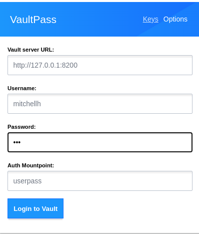

# vaultPass

A Browser extension to leverage Hashicorp Vault as Credential Storage for teams

A project started on a Hackathon @ ironSource by [Dimitry1987](https://github.com/Dmitry1987) and continued by [Chris Blum](https://github.com/zeichenanonym)

**Get it:**\
&nbsp;&nbsp; [Chrome Store](https://chrome.google.com/webstore/detail/vaultpass/kbndeonibamcpiibocdhlagccdlmefco)\
&nbsp;&nbsp; [Firefox AMO](https://addons.mozilla.org/en-GB/firefox/addon/vaultpass/)

## Current features

1. Connect to Vault and get Token
2. Get list of potential credentials in Popup
3. Select credentials from popup and have them filled into the website
4. Copy username & password to the clipboard

## Requirements

Vault needs to be prepared to use this extention.
This extention expects secrets to be saved in the 'secret' mount path (the default KV store).
Version 1 and 2 of the KV store are supported - only difference are the Vault policies you will have to write.
The path in this mount should be `/vaultPass/[someOrg]/url` where:

- `someOrg` will be some organisational level in your company to separate access levels
  - You can activate and deactivate these "folders" in options
- `url` is a URL or part of it that the credentials should match for
  - Be aware that \* characters (and potentially others...) may not work!
  - It should have _at least_ the keys `username` and `password` with the respective information
- Get a Token via the options page of this extention

## Example policies

There are two short docs to get your started with access policies:

- [KV version 1](docs/access_policies_v1.md)
- [KV version 2](docs/access_policies_v2.md)

If you just installed Vault - you propably have Version 2.

## TODO

- Create application specific Token instead of using the user-token
- Write (new) credentials to Vault
  - Out of scope --> Do this directly in Vault for now

## Notes

Tested with Vault 1.0.x

## Contribute

### Pre-Commit Hook

If you contribute, please install the [pre-commit Hook](https://pre-commit.com/).
If you have no idea what I am talking about - it's as easy as this:

```bash
pip install pre-commit
pre-commit install
```

This will install the hook and will run [checks](.pre-commit-config.yaml) before you commit changes.

### Setup development Vault instance

Afterwards you can set up a development Vault instance using the `./start_dev_environment.sh` script. The script will use docker (also works with podman) to start a local Vault in dev mode and configure a user `mitchellh` with password `foo` for the userpass module. There is a default VaultPass secret for `google.com`.

You can also reach the Vault Web UI via http://localhost:8200/ui and login with the `myroot` token.

When you run the script, the output should look like this:

```bash
$ ./start_dev_environment.sh
Emulate Docker CLI using podman. Create /etc/containers/nodocker to quiet msg.
b33e3011ad86a433c302fd09ccf26328e4a3111ad7846109356dc303bdf7ac42
Emulate Docker CLI using podman. Create /etc/containers/nodocker to quiet msg.
Emulate Docker CLI using podman. Create /etc/containers/nodocker to quiet msg.
Success! You are now authenticated. The token information displayed below
is already stored in the token helper. You do NOT need to run "vault login"
again. Future Vault requests will automatically use this token.

Key                  Value
---                  -----
token                myroot
token_accessor       6WGnPUCMS86zpvSNLb5rpU4x
token_duration       ∞
token_renewable      false
token_policies       ["root"]
identity_policies    []
policies             ["root"]
Key              Value
---              -----
created_time     2021-08-12T07:08:04.632218096Z
deletion_time    n/a
destroyed        false
version          1
Key              Value
---              -----
created_time     2021-08-12T07:08:04.66406695Z
deletion_time    n/a
destroyed        false
version          1
Success! Enabled userpass auth method at: userpass/
Success! Data written to: auth/userpass/users/mitchellh
Success! Data written to: sys/policy/default

```

Afterwards you can login to this Vault instance with the VaultPass extension like this:


Use `foo` as the password for the `mitchellh` user.

This user has access to the secrets in the `Admin` folder and no access to the secrets in the `Denied` folder. This is defined in the [dev_default.hcl](dev_default.hcl) file and applied by the [start_dev_environment.sh](start_dev_environment.sh) script.

To stop and delete this Vault instance run this command:

```bash
docker rm -f dev-vault
```

Afterwards it can be recreated with the [start_dev_environment.sh](start_dev_environment.sh) script.
